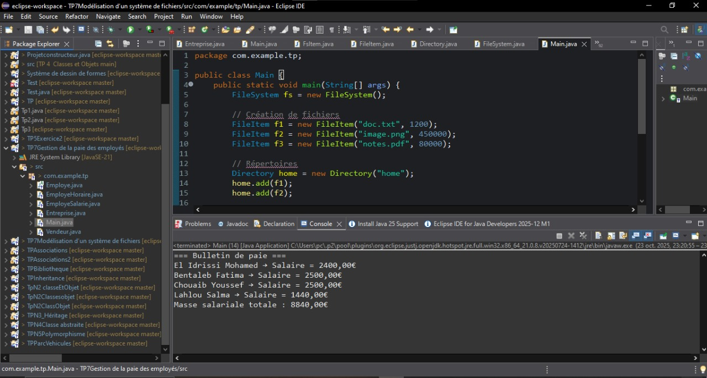
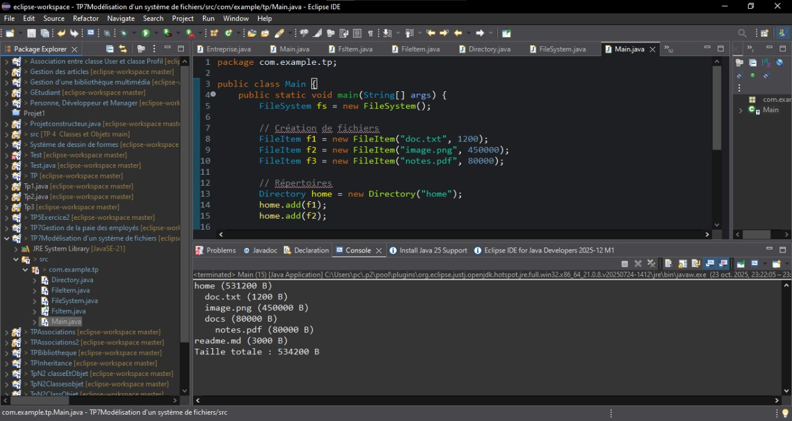

# TP 7 — Classes Abstraites en Java
**Cours : Fondamentaux et Concepts Avancés de la Programmation Java**

---

##  Objectif général
Ce TP vise à maîtriser les **classes abstraites**, l’**héritage**, le **polymorphisme**, et la **gestion dynamique des objets** en Java à travers deux mini-projets :

1. **Exercice 1 — Gestion de la paie des employés**
2. **Exercice 2 — Modélisation d’un système de fichiers**

Chaque exercice illustre un cas concret d’utilisation des classes abstraites et de la programmation orientée objet.

---
##  Exercice 1 — Gestion de la paie des employés

###  But de l’exercice
Modéliser un système de paie pour une entreprise contenant différents types d’employés :
- Des employés horaires,
- Des salariés fixes,
- Des vendeurs à commission.  

L’objectif est de **calculer automatiquement le salaire** selon le type d’employé grâce au **polymorphisme**.
---
### Structure du projet
TP7Gestion de la paie des employés/
└─ src/
└─ com/example/tp/
├ Employe.java
├ EmployeHoraire.java
├ EmployeSalarie.java
├ Vendeur.java
├ Entreprise.java
└ Main.java

###  Classes principales

- **Employe (abstraite)**  
  Contient `nom`, `prenom`, et la méthode abstraite `calculerSalaire()`.

- **EmployeHoraire**  
  Calcule le salaire selon le taux horaire × heures travaillées.

- **EmployeSalarie**  
  Représente un salarié avec un salaire mensuel fixe.

- **Vendeur**  
  Hérite de `EmployeSalarie` et ajoute une `commission`.

- **Entreprise**  
  Gère un tableau dynamique d’employés et affiche la masse salariale.

  
##  Résultat visuel

<div align="center">  <p><em>Figure 1 — </em></p> </div>

##  Exercice 2 — Modélisation d’un système de fichiers

###  But de l’exercice

Créer une simulation simplifiée d’un **système de fichiers**.  
Chaque élément peut être :
- un **fichier** (`FileItem`),  
- ou un **dossier** (`Directory`) pouvant contenir d’autres éléments.  

L’objectif est de **calculer la taille totale** du système et d’**afficher sa structure arborescente**.

---

###  Structure du projet
TP7-Modélisation d’un système de fichiers/
└─ src/
└─ com/example/tp/
├ FsItem.java
├ FileItem.java
├ Directory.java
├ FileSystem.java
└ Main.java

yaml
Copier le code

---

###  Classes principales

- **FsItem (abstraite)**  
  Déclare les propriétés communes (`name`) et la méthode abstraite `getSize()`.

- **FileItem**  
  Représente un fichier et retourne directement sa taille.

- **Directory**  
  Contient un tableau dynamique de `FsItem` (fichiers et sous-dossiers),  
  calcule récursivement la taille totale et affiche la structure avec indentation.

- **FileSystem**  
  Gère les éléments racine du système de fichiers et fournit la taille totale.

---
##  Résultat visuel

<div align="center">  <p><em>Figure 2 — </em></p> </div>

## Compilation & exécution
```bash
cd src
javac com/example/tp/*.java
java com.example.tp.Main
```


